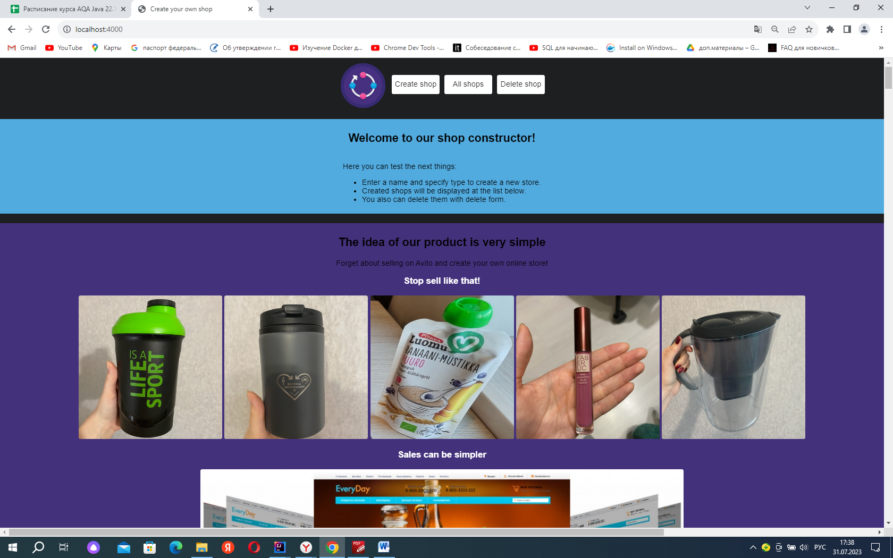
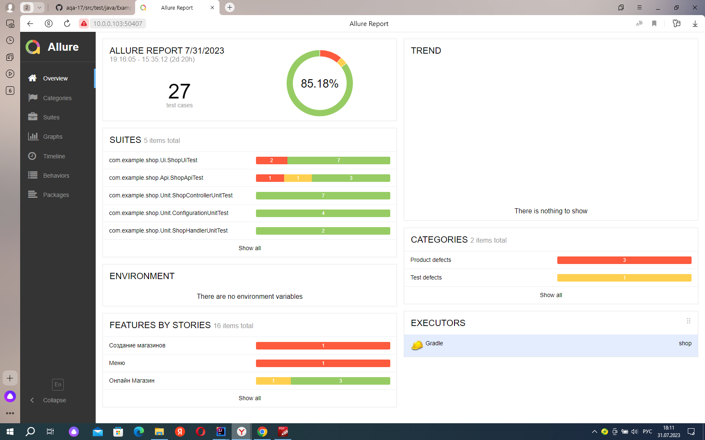
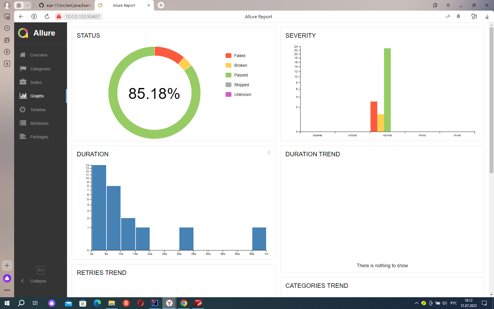

                                              ИТОГОВАЯ АТТЕСТАЦИЯ 
В ходе выполнения итоговой аттестации предстояло написать unit, Api и E2E тесты, для веб приложения, которое выводит
список магазинов https://github.com/npolyakova/shop

Сайт дает возможность создовать, получать информацию о существующих магазинах, удалять магазины.

                           В ходе реализации тестов, были использованы следующие интрументы:

1.Junit;
2.RestAssured;
3.Allure;
4.Selenide;
5.OkHttp3;
6.Mockito;
7.Gradle;

                                           Проект аттестации включает:
1.Api - package api-тестов;
2.Ui -  package ui-тестов;
3.Unit - package unit-тестов;

                                    Проект включает в себя следующие тесты
Создание магазина;
Получение всех магазинов;
Получение магазина по ID;
Удаление магазина;
Создание магазина с именем более 6 символов и заглавной буквы;
Создание магазина без заглавной буквы;
Создание магазина менне чем с 7 символами;
Создание магазина с различной комбинацией символов, но с заглавной буквой;
Создание магазина с именем содержащим 256 символов;
Получение существующего магазина;
Проверка отображения главной страницы: url, приветствие, иконка в заголовке;
Проверка наличия основных кнопок-ссылок в верхней части главной страницы;
Проверка работоспособности основных кнопок-ссылок в верхней части главной страницы;
Проверка кнопки Create shop;
Проверка кнопки All shops;
Проверка кнопки Delete shop;
Проверка кнопки refresh;
Проверка кнопки Telegram;
Проверка кнопки VK.

