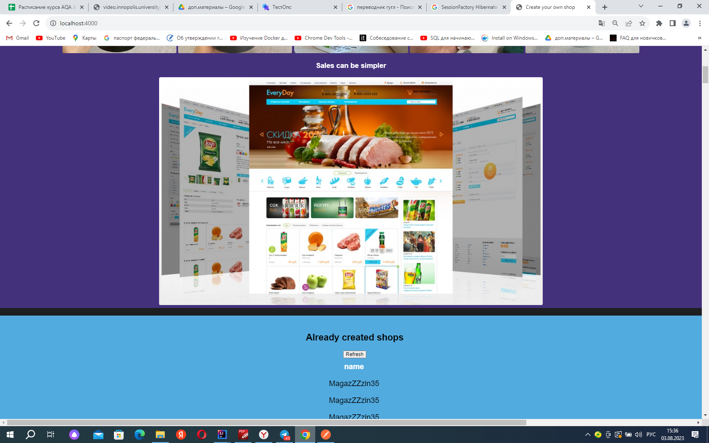

                                              ИТОГОВАЯ АТТЕСТАЦИЯ 
В ходе выполнения итоговой аттестации были написаны unit, Api и E2E тесты, для веб приложения, которое выводит
список магазинов https://github.com/npolyakova/shop

Сайт дает возможность создовать онлайн магазины, получать информацию о существующих магазинах, удалять магазины.

                                          В ходе написания тестов, были использованы:
Библиотеки:
1.Junit;
2.RestAssured;
3.OkHttp3;
4.Mockito;

Сборщик проектов:
1. Gradle;

Фреймворк для создания отчетов автотестов:
1.Allure;

Фреймвор для автоматизированного тестирования веб-приложений на основе Selenium WebDriver:
4.Selenide.

                                           Проект содержит следующие пэкиджи:
1. package api-тестов;
2. package ui-тестов;
3. package unit-тестов;

                                            Проект содержит следующие тесты:
UNIT:
1.Добавление магазина, с названием содержащим более 6 символов и начинающихся с Заглвной буквы;
2.Отрицательный тест. Добавление магазина, с названием начинающимся не с Заглавной буквы;
3.Отрицательный тест. Добавление магазина с названием содержащим 6 символов;
4.Добавление магазина, в названием которого входят любые символы, но начинатся с Заглавной буквы;
5.Добавление магазина, с названием содержащим 256 символов;
6.Получения всех магазинов;
7.Получение существующего магазина;
8.Проверка количества букв названия магазина, который равен или больше количества магазинов;
9.Отрицательный тест. Проверка количества букв названия магазина, который меньше количества магазинов;
10.Получени свойств в верной конфигурацией;
11.Получение исключения при построении экземпляра объекта SessionFactory не равному нуль;
12.Получение исключения при получении экземпляра объекта равному нуль;
13.Получение нового объекта session, при маппинге для базы данных;

API:
1.Создание магазина;
2.Получение всех магазинов;
3.Получение магазина по ID;
4.Удаление магазина;

UI:
1.Проверка отображения главной страницы: url, приветствие, иконка в заголовке;
2.Проверка наличия основных кнопок-ссылок в верхней части главной страницы;
3.Проверка работоспособности основных кнопок-ссылок в верхней части главной страницы;
4.Проверка кнопки Create shop;
5.Проверка кнопки All shops;
6.Проверка кнопки Delete shop;
7.Проверка кнопки refresh;
8.Проверка кнопки Telegram;
9.Проверка кнопки VK.

                                              Отчеты автотестов Allure

